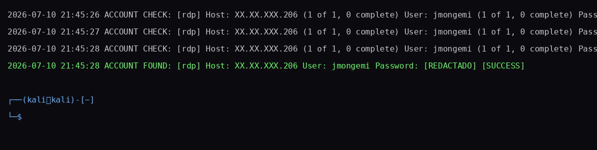
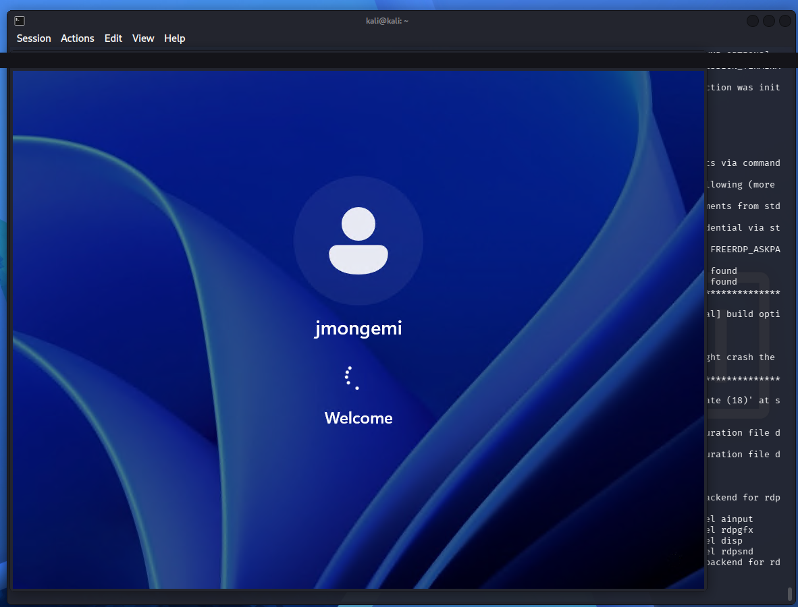

# 🛡️ Auditoría de Autenticación RDP y Análisis de Directivas de Bloqueo (Azure)

Laboratorio práctico realizado como parte del curso **Gestión de Riesgos** (Universidad Cenfotec). El objetivo fue auditar la seguridad de un servidor Windows Server alojado en Microsoft Azure, simulando un ataque de fuerza bruta contra el servicio de Escritorio Remoto (RDP) y analizando cómo las políticas de bloqueo de cuentas afectan el resultado de las herramientas de auditoría automatizadas.

> ⚠️ **Entorno controlado.** Prueba autorizada realizada sobre infraestructura de laboratorio provista por la cátedra, con fines exclusivamente educativos. Las credenciales y direcciones IP mostradas en este documento están enmascaradas por motivos de seguridad.

## 👤 Estudiante

- Josué Monge

## 🎯 Objetivo del laboratorio

Identificar vulnerabilidades asociadas al uso de contraseñas débiles en el servicio RDP mediante un ataque de fuerza bruta con Medusa, y comprender cómo las directivas de bloqueo de cuentas (*Account Lockout Policy*) de Windows pueden inducir falsos positivos en herramientas de auditoría de seguridad.

## 🛠️ Herramientas utilizadas

- **Kali Linux**
- **Nmap** — reconocimiento y escaneo de puertos
- **Medusa** — fuerza bruta de credenciales contra RDP
- **xfreerdp** — cliente RDP para validación de acceso gráfico
- **Microsoft Azure** — infraestructura del servidor objetivo (Windows Server)

## 📋 Metodología

### 1. Reconocimiento del objetivo
Se realizó un escaneo selectivo de puertos para identificar servicios expuestos orientados a autenticación:

```bash
nmap -p 445,3389 XX.XX.XXX.XXX
```

**Resultado:** el puerto **445/tcp (SMB)** apareció filtrado, mientras que el **3389/tcp (RDP)** estaba completamente abierto, confirmando el vector de ataque viable.

### 2. Simulación de fuerza bruta — falso positivo por bloqueo de cuenta
Se configuró un ataque dirigido al usuario objetivo usando un diccionario provisto por la cátedra:

```bash
medusa -h XX.XX.XXX.XXX -u jmongemi -P /usr/share/wordlists/metasploit/common_roots.txt -M rdp
```

**Comportamiento observado:** la herramienta reportó prematuramente un hallazgo (`ACCOUNT FOUND`) acompañado de un `UNKNOWN_ERROR_CODE`. Al analizarlo, se determinó que el servidor tenía activa su **política de bloqueo de cuentas**: al detectar la ráfaga de intentos, el sistema interrumpió el *handshake* RDP, y Medusa interpretó ese cierre forzado como una autenticación exitosa — un **falso positivo**.

### 3. Explotación exitosa con seguridad atenuada
Tras ajustar las directivas del servidor para simular un escenario sin controles defensivos estrictos, se relanzó el ataque bajo las mismas condiciones.

**Resultado:** Medusa procesó el diccionario limpiamente y confirmó la credencial real con la bandera **`[SUCCESS]`**.



### 4. Acceso gráfico (post-explotación)
Para validar la legitimidad de la credencial obtenida, se estableció una sesión de escritorio remoto visual con el cliente `xfreerdp`:

```bash
xfreerdp /v:XX.XX.XXX.XXX /u:jmongemi /p:[REDACTADO]
```



## 🔎 Análisis de la vulnerabilidad

1. **Contraseña débil y diccionarizable** — la credencial del usuario objetivo era descifrable con un diccionario estándar, sin necesidad de fuerza bruta exhaustiva.
2. **RDP expuesto directamente a Internet** — el servicio de administración remota estaba accesible desde cualquier IP pública, sin capas adicionales de protección.
3. **Falsos positivos por controles defensivos activos** — las políticas de bloqueo de cuentas, si bien son una buena práctica de seguridad, pueden alterar el comportamiento esperado de herramientas de auditoría y llevar a conclusiones erróneas si no se interpretan correctamente.

## 📚 Aprendizajes clave

- La importancia de **restringir el acceso directo a RDP** desde Internet mediante VPN o soluciones tipo Bastion.
- Por qué las **políticas de bloqueo de cuentas** son una medida defensiva crítica, y cómo pueden generar ruido en pruebas de auditoría si no se analizan con cuidado.
- La necesidad de exigir **MFA (autenticación multifactor)** incluso en servicios internos o de administración.
- Cómo diferenciar un hallazgo real de un falso positivo al correlacionar el comportamiento de la herramienta con las políticas de seguridad del sistema objetivo.

## 🛡️ Recomendaciones de mitigación

- Deshabilitar el acceso directo a RDP desde direcciones IP públicas.
- Implementar una pasarela VPN o solución Bastion para el acceso administrativo remoto.
- Exigir Doble Factor de Autenticación (MFA) en todos los servicios de administración.
- Establecer políticas de contraseñas robustas y rotación periódica de credenciales.

---

📌 *Proyecto académico desarrollado para el curso de Gestión de Riesgos — Universidad Cenfotec.*
